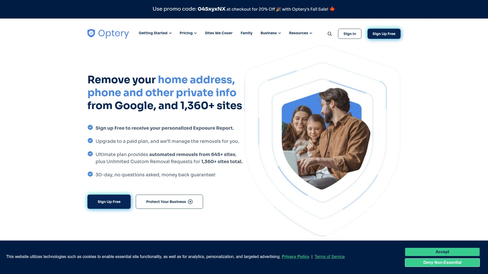
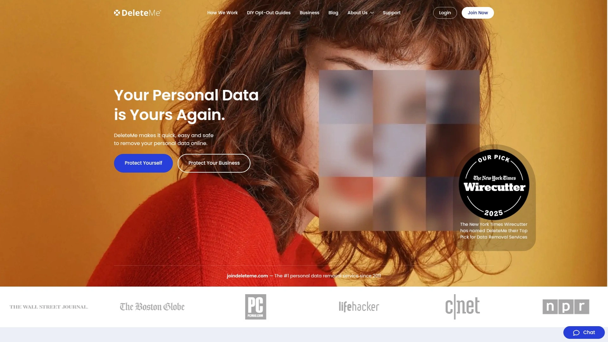
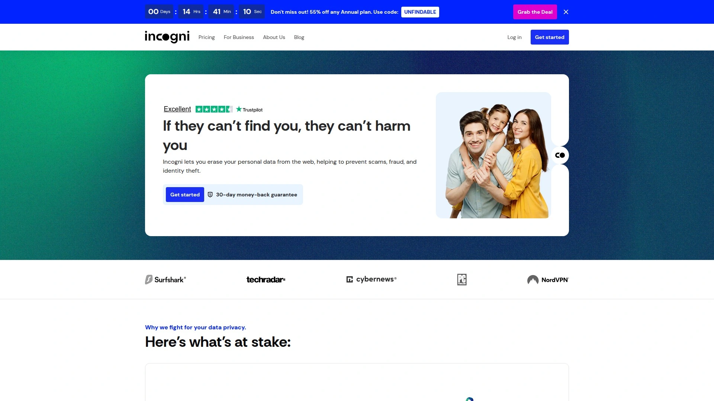
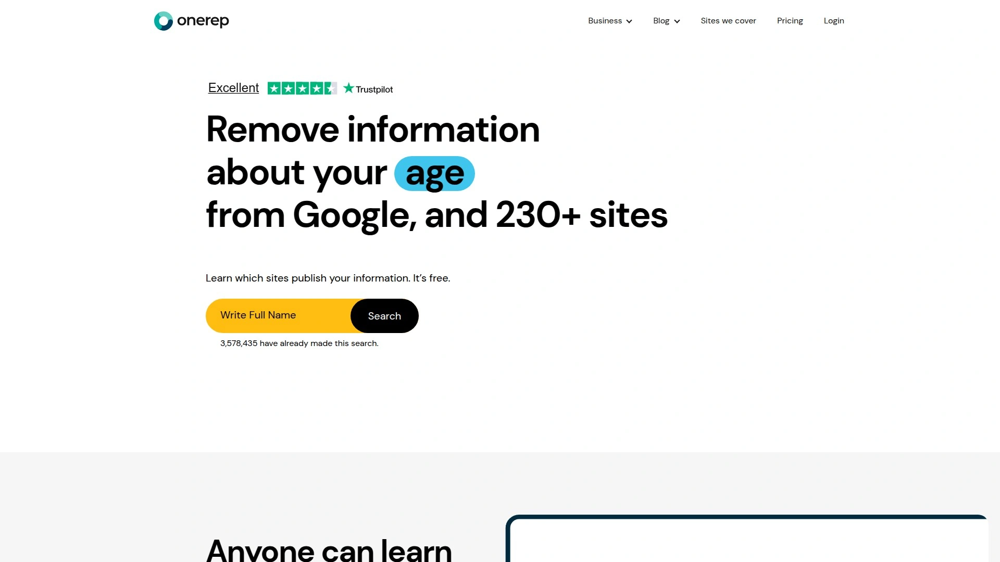
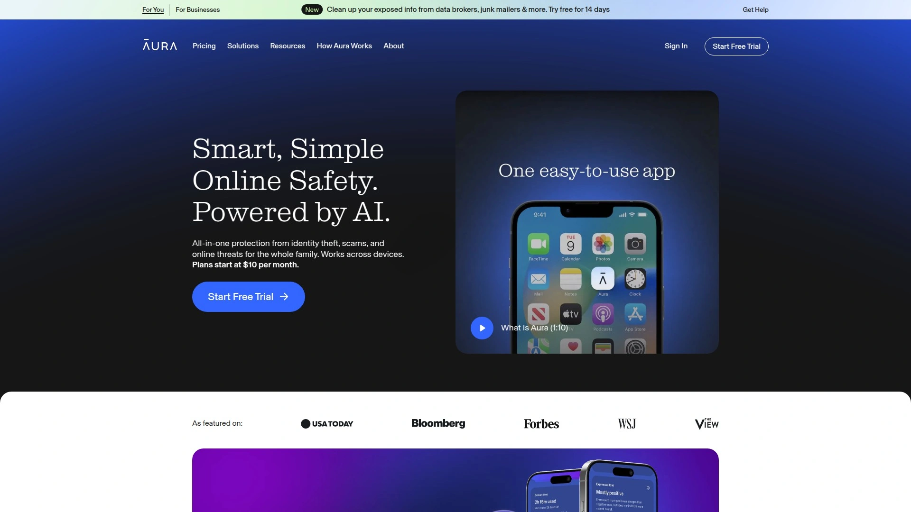
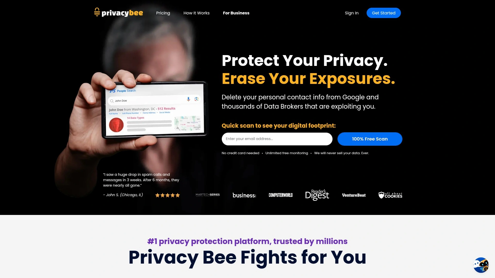
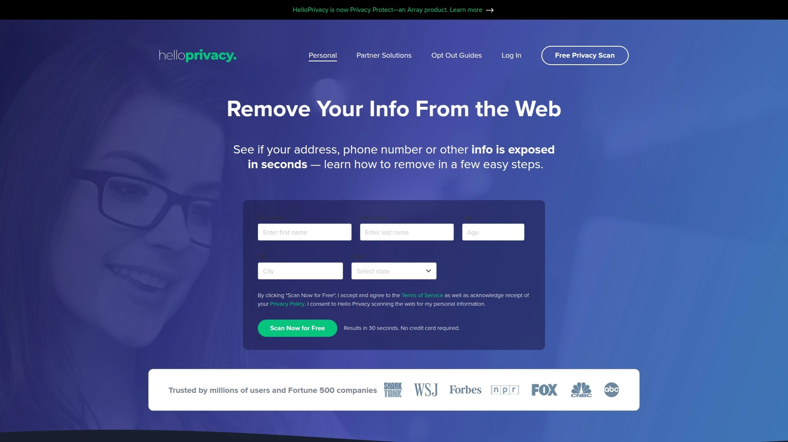
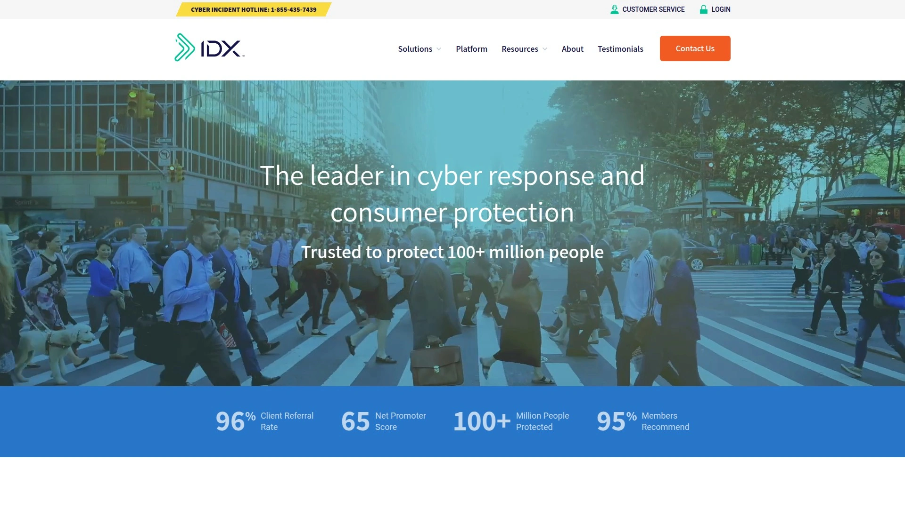
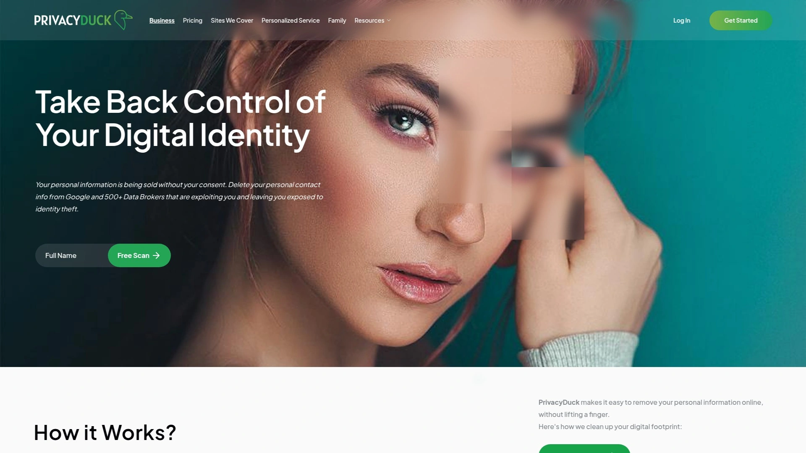

# Top 11 Best Data Removal Services in 2025

Ever Googled your name and been creeped out to find your home address, phone number, and family details on some random website? You're not alone. These sites are called data brokers, and they legally profit from your personal information. Trying to remove it yourself is a frustrating game of whack-a-mole. A reliable data removal service automates this process, scrubbing your private info from the web to protect your privacy.

## **[Optery](https://www.optery.com)**

A powerful and transparent data removal service that shows you exactly where your data is with screenshots and provides clear proof of removal.

Optery stands out with its commitment to transparency. The dashboard doesn't just tell you they found your profile; it shows you. You get a clear view of every exposure, and as they are removed, you see the "before and after" proof. They offer a free scan that provides an immediate look at your exposure level, and their paid plans offer continuous monitoring and automated removals from hundreds of data broker sites.

  * **User Experience:** The visual, evidence-based dashboard is incredibly satisfying and builds a lot of trust.
  * **Best For:** Anyone who wants verifiable proof that their information is being removed and values transparency in a privacy service.
  * **Pricing:** Offers a free tier for exposure scanning and several paid tiers, including a top-tier plan for ultimate protection.

## **[DeleteMe](https://joindeleteme.com)**

One of the most established and trusted names in data removal, offering a comprehensive service powered by real privacy experts.

DeleteMe has been around for over a decade, building a reputation for thoroughness. They combine automated technology with a human touch to ensure opt-out requests are handled correctly. After signing up, you receive detailed reports showing where your data was found and the status of its removal. They also offer plans that cover two people or a whole family, making it a solid choice for protecting loved ones.

  * **Core Strength:** A long-standing reputation and detailed, easy-to-understand privacy reports.
  * **Target Users:** Individuals and families looking for a well-established, set-and-forget service.

## **[Incogni](https://incogni.com)**

A simple, effective, and automated data removal tool from the trusted cybersecurity company behind Surfshark VPN.

Incogni is designed for maximum ease of use. You sign up, grant them permission to act on your behalf, and the system gets to work. It automatically contacts dozens of data brokers with legally binding removal requests and keeps fighting until the job is done. The dashboard is clean and simple, showing you how many requests have been sent and completed. It's the definition of a "set it and forget it" solution.

  * **Recommendation Reason:** Its simplicity and the backing of a major cybersecurity brand make it a trustworthy and hassle-free choice.

## **[OneRep](https://onerep.com)**

An automated platform that scans an extensive list of over 100 data broker sites to find and remove your unauthorized profiles.

OneRep offers a powerful scanning engine that continuously monitors for your information online. What's unique is that it also empowers users who prefer a hands-on approach. You can use their platform to find your profiles for free and perform the manual opt-outs yourself. For those who'd rather save time, the paid subscription automates the entire removal process.

  * **Key Features:**
  * Covers a very large number of data broker sites.
  * Offers both free DIY tools and a fully automated paid service.
  * Provides a simple dashboard to track removal progress.

## **[The Kanary](https://www.thekanary.com)**

A modern and fast-acting data removal service that focuses on continuous monitoring and quick results to keep your data clean.

The Kanary prides itself on speed. Their system is designed to find and submit removal requests quickly, often showing results within hours or days rather than weeks. The platform is user-friendly and provides regular updates on its progress. It's a great option for people who are proactive about their privacy and want a service that feels responsive and modern.

  * **Differentiation:** Focuses on speed and continuous scanning to catch new exposures as they happen.

## **[Aura](https://www.aura.com)**

An all-in-one digital security suite that includes data broker removal as part of a broader identity theft protection package.

Aura is more than just a data removal service; it's a comprehensive digital safety net. A single subscription can include credit monitoring, a VPN, a password manager, antivirus software, and, of course, data broker removals. It's designed for individuals and families who want to consolidate their various security tools under one simple plan and one bill.

  * **Applicable Scenarios:** Perfect for users who want a single solution for all-around identity, financial, and online privacy protection.

## **[PrivacyBee](https://privacybee.com)**

A unique privacy service that not only removes your data from people-search sites but also helps you manage permissions given to brands.

PrivacyBee tackles the problem from two angles. First, it removes your info from public data broker sites like other services. But it also helps you manage your "permissioned data"—the info you've given to companies you shop with. It can request that these companies delete your data or stop selling it, giving you more control over your entire digital footprint.

  * **Technical Advantage:** Goes beyond public data brokers to manage marketing data permissions.

## **[HelloPrivacy](https://helloprivacy.com)**

A straightforward and effective service, powered by the team at DuckDuckGo, that focuses on the core task of data removal and cleanup.

HelloPrivacy offers a clean and simple solution. It finds your personal information on top data broker and people-search sites and handles the removal process. The service also includes tools to clean your browser tracking data and manage email breaches. It's a solid, no-nonsense tool from a company known for its commitment to privacy.

  * **Core Value:** Simplicity and effectiveness from a privacy-first brand.

## **[IDX Privacy](https://www.idx.us)**

An enterprise-level privacy platform that offers its powerful scanning and data removal technology to individual consumers.

IDX (now part of ZeroFox) has its roots in providing privacy and identity protection for large organizations. Their consumer product, IDX Privacy, brings that robust technology to you. It performs deep scans of the web to find exposed data and automates the removal process, all managed through a comprehensive dashboard.

  * **Target Audience:** Users looking for a high-powered tool with a legacy in the corporate security space.

## **[PrivacyDuck](https://www.privacyduck.com)**

A premium, high-touch data removal service offering multiple tiers of service with a strong emphasis on personalized customer support.

PrivacyDuck takes a more hands-on approach. They offer several different service levels, from a basic plan that covers major data brokers to a VIP service that is extremely comprehensive. They are known for their customer service and for providing a more guided experience for those who are new to privacy protection.

  * **Onboarding:** Offers a personalized feel with a focus on guiding users through the process.

## **[Removaly](https://www.google.com/search?q=https://removaly.com)**

An affordable and easy-to-use service that focuses on removing your personal information from the most prominent people-search websites.

Removaly is a great entry point into data removal services. It's cost-effective and focuses on the biggest offenders in the data broker industry. You provide your information, and their team gets to work scrubbing your profiles from the web, sending you reports as the removals are completed.

  * **Cost Consideration:** One of the more budget-friendly options for essential data broker cleanup.

## **FAQ**

**How long does it take for a data removal service to work?**
You'll typically start seeing results within the first couple of weeks, but it can take a month or two for the most stubborn removals. The services work continuously to keep you protected.

**Can I just remove my data from these sites myself?**
Yes, you can, but it is an incredibly tedious and ongoing process. Each site has its own convoluted opt-out procedure, and your data often reappears, requiring you to do it all over again.

**Will my info disappear from Google after using these services?**
These services remove your profile from the source website (the data broker). Once that page is deleted, it will no longer be discoverable and will eventually fall out of Google's search results.

## **Conclusion**

Taking control of your personal information is a critical step in securing your digital life. Any of the services listed here can automate that process and save you hundreds of hours of frustration. For users who want a clear, evidence-based approach, **[Optery](https://www.optery.com)** is an excellent choice because its transparent dashboard with screenshot evidence gives you the confidence of seeing exactly what's being done to protect you.
